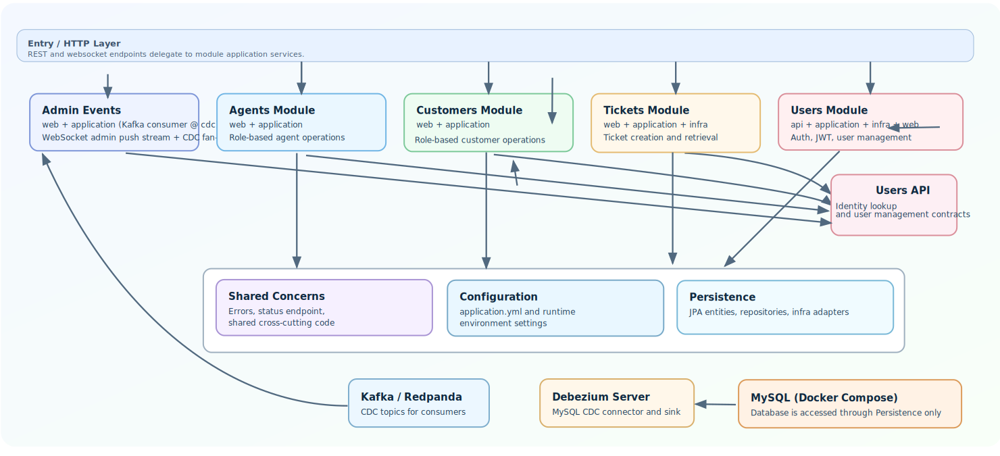

# Agents Customers Tickets

Spring Boot backend service implemented as a modular monolith (clear internal modules, single deployable).

## Modular monolith boundaries (phase 1)

Users persistence internals are now encapsulated inside the `users` module:

- `UserRepository` and `UsersService` remain in `users.infra` and are not consumed directly by other modules.
- Other modules depend on `users.api` contracts for user read/write access:
  - [`users/api/User.java`](src/main/java/com/agentscustomerstickets/users/api/User.java)
  - [`users/api/UserDirectory.java`](src/main/java/com/agentscustomerstickets/users/api/UserDirectory.java)
  - [`users/api/UserManagement.java`](src/main/java/com/agentscustomerstickets/users/api/UserManagement.java)
- Infrastructure adapter inside the `users` module:
  - [`users/infra/UserDirectoryAdapter.java`](src/main/java/com/agentscustomerstickets/users/infra/UserDirectoryAdapter.java)
  - [`users/infra/UserManagementAdapter.java`](src/main/java/com/agentscustomerstickets/users/infra/UserManagementAdapter.java)

[](docs/architecture.svg)

See [Appendix: Phase 2 Users Internal Microservice](#appendix-phase-2-users-internal-microservice) which extends phase 1 by allowing to run users capabilities in a separate `users-service` process while keeping the modular monolith boundaries and API contracts intact.

## Prerequisites

- Java 21
- Spring Boot 3.x
- Docker (optional, for MySQL)

## Development

```bash
# Start only MySQL
docker compose up -d mysql

# Build the application
./scripts/build.sh # --run, --help

# Run the application service
java -jar target/agents-customers-tickets-0.0.1-SNAPSHOT.jar
```

## Deployment

With [docker-compose.yml](docker-compose.yml):

```bash
# Start MySQL and run the application service
docker compose up -d
```

The application service listens on `http://localhost:8080`.

## Scripts

- `./scripts/build.sh` (builds the application and runs unit/integration tests)
- `./scripts/deploy.sh`
- `./scripts/smoke-test.sh` (end-to-end smoke test; run while the service is up)
- `./scripts/websocket-test.sh` (connects as admin to websocket and prints pushed admin events)
- `./scripts/undeploy.sh`
- `./scripts/clean.sh`

## Requirements mapping

### General

- **Spring Boot 3.x**
  - [`pom.xml`](pom.xml)
  - [`Application.java`](src/main/java/com/agentscustomerstickets/Application.java)

- **Spring Data JPA (Java Persistence API) over MySQL**:
  - Entities / repositories:
    - [`users/infra/UserEntity.java`](src/main/java/com/agentscustomerstickets/users/infra/UserEntity.java)
    - [`users/infra/UserRepository.java`](src/main/java/com/agentscustomerstickets/users/infra/UserRepository.java)
    - [`tickets/infra/TicketEntity.java`](src/main/java/com/agentscustomerstickets/tickets/infra/TicketEntity.java)
    - [`tickets/infra/TicketRepository.java`](src/main/java/com/agentscustomerstickets/tickets/infra/TicketRepository.java)
  - MySQL configuration:
    - [`src/main/resources/application.yml`](src/main/resources/application.yml)
    - [`docker-compose.yml`](docker-compose.yml)

- **REST API via Spring MVC** with **Spring Validation**
  | Method | Endpoint | Access / Notes |
  | --- | --- | --- |
  | `POST` | `/api/auth/token` | Public login endpoint. Accepts username/password and returns JWT `access_token`. |
  | `GET`, `PUT` | `/api/me` | Requires valid `Authorization: Bearer <token>`. Read/update current authenticated user profile. |
  | `POST` | `/api/agents` | `ADMIN` only. Creates a new agent user/account. |
  | `GET` | `/api/agents` | `ADMIN` only. Lists all agent accounts. |
  | `POST` | `/api/customers` | `AGENT` can create own customers; `ADMIN` can create customers when `agentId` is provided. |
  | `GET` | `/api/customers` | `AGENT` sees customers assigned to that agent; `ADMIN` can list all or filter by `agentId`. |
  | `POST` | `/api/tickets` | `CUSTOMER` only. Creates a ticket tied to the authenticated customer users. |
  | `GET` | `/api/tickets` | Role-based result set: `CUSTOMER` sees own tickets, `AGENT` sees assigned tickets, `ADMIN` can query globally and filter by `agentId` and/or `customerId`. |
  | `WS (STOMP)` | `/ws/admin-events` | `ADMIN` only (JWT Bearer in `CONNECT` headers). Subscribe to `/topic/admin/events` for admin push events. |
  - Request DTO annotations are used across controllers, e.g.:
    - [`createCustomer`](src/main/java/com/agentscustomerstickets/customers/web/CustomersController.java#L60) in [`CustomersController`](src/main/java/com/agentscustomerstickets/customers/web/CustomersController.java)
    - [`CreateTicketRequest`](src/main/java/com/agentscustomerstickets/tickets/web/TicketsController.java#L53) in [`TicketsController`](src/main/java/com/agentscustomerstickets/tickets/web/TicketsController.java)
  - **Return correct HTTP statuses (200/400/401/403/404/409)** with **human-readable error responses**
    - Central exception-to-status mapping:
      - [`shared/error/ApiExceptionHandler.java`](src/main/java/com/agentscustomerstickets/shared/error/ApiExceptionHandler.java)
      - [`shared/error/ApiErrorResponse.java`](src/main/java/com/agentscustomerstickets/shared/error/ApiErrorResponse.java)
    - Custom exceptions:
      - [`shared/error/ResourceNotFoundException.java`](src/main/java/com/agentscustomerstickets/shared/error/ResourceNotFoundException.java)
      - [`shared/error/ConflictException.java`](src/main/java/com/agentscustomerstickets/shared/error/ConflictException.java)
    - Authentication/authorization (401/403):
      - [`users/infra/SecurityConfig.java`](src/main/java/com/agentscustomerstickets/users/infra/SecurityConfig.java)

### Role-Based Access Control (RBAC)

Users can only access resources appropriate to their role.

- Role enum: [`ADMIN`, `AGENT`, `CUSTOMER`](src/main/java/com/agentscustomerstickets/users/api/Role.java)
- **JWT Claims**: Roles are embedded in JWT tokens in [`issueAccessToken`](src/main/java/com/agentscustomerstickets/users/infra/NimbusJwtService.java#L27) and mapped to Spring Security authorities in [`jwtAuthConverter`](src/main/java/com/agentscustomerstickets/users/infra/SecurityConfig.java#L70).
- Example of method-level security, using `@PreAuthorize` annotations:
  [`agents/web/AgentsController.java`](src/main/java/com/agentscustomerstickets/agents/web/AgentsController.java)
- Username/password authentication and JWT security flow:
  - Token issuance endpoint:
    - `POST /api/auth/token`
    - [`users/web/AuthController.java`](src/main/java/com/agentscustomerstickets/users/web/AuthController.java)
  - Authentication logic:
    - [`users/infra/UsersService.java`](src/main/java/com/agentscustomerstickets/users/infra/UsersService.java)

### Unit testing

- Unit tests to **some services** : [`src/test/java/com/agentscustomerstickets/customer/application/CustomerServiceTest.java`](src/test/java/com/agentscustomerstickets/customers/application/CustomerServiceTest.java)

- At least 1 **security-aware** unit test : `meRequiresAuthentication` in [`src/test/java/com/agentscustomerstickets/SecurityIntegrationTest.java`](src/test/java/com/agentscustomerstickets/SecurityIntegrationTest.java)

### Deliverables

- **[`README.md`](README.md)** (the current file) describing the project and how to build and run
- **[`Dockerfile`](Dockerfile)** for the application service
- **[`docker-compose.yml`](docker-compose.yml)** for local orchestration (MySQL + application service)

### Admin websocket events

- Endpoint: `/ws/admin-events` (STOMP over WebSocket)
- Topic: `/topic/admin/events`
- Security: JWT Bearer token is required in STOMP `CONNECT` headers; only `ADMIN` can connect/subscribe.
- Initial published events:
  - `AGENT_CREATED`
  - `CUSTOMER_CREATED`
- Main components:
  - [`admin/events/web/AdminEventsWebSocketConfig.java`](src/main/java/com/agentscustomerstickets/admin/events/web/AdminEventsWebSocketConfig.java)
  - [`admin/events/web/AdminEventsWebSocketAuthInterceptor.java`](src/main/java/com/agentscustomerstickets/admin/events/web/AdminEventsWebSocketAuthInterceptor.java)
  - [`admin/events/application/AdminEventsPublisher.java`](src/main/java/com/agentscustomerstickets/admin/events/application/AdminEventsPublisher.java)

Quick local check:

```bash
./scripts/websocket-test.sh
```

### CDC (MySQL Create/Modify/Delete to Kafka)

`docker-compose.yml` enables MySQL row-based binary logging and runs Debezium Server (profile `cdc`) to publish CDC events to Kafka.

The admin Kafka consumer that republishes each consumed CDC message to `/topic/admin/events` (see [Admin websocket events](#admin-websocket-events)) is controlled by Spring profile `cdc` (runtime), not by Maven build profiles.

The `cdc` profile includes a local Redpanda broker and Redpanda Console.

When running in Docker Compose, the app Kafka consumer uses `KAFKA_BOOTSTRAP_SERVERS=redpanda:9092` (container network).
When running the JAR locally, the default remains `localhost:19092`.

For topic-pattern subscriptions, the consumer metadata refresh is set to 10s (`ADMIN_EVENTS_CDC_METADATA_MAX_AGE_MS`) so newly created Debezium topics (for example `...tickets`) are discovered quickly.

Run with CDC enabled:

```bash
SPRING_PROFILES_ACTIVE=docker,cdc docker compose --profile cdc up -d
docker compose logs -f debezium
```

If you run the JAR directly instead of Compose, enable profile `cdc` the same way:

```bash
SPRING_PROFILES_ACTIVE=cdc java -jar target/agents-customers-tickets-0.0.1-SNAPSHOT.jar
```

If you run via the build script, `--run` does not add `cdc` automatically, so pass it through the environment:

```bash
SPRING_PROFILES_ACTIVE=cdc ./scripts/build.sh --run
```

Local endpoints:

- Kafka broker: `localhost:19092`
- Redpanda Console: `http://localhost:8089`

Debezium target broker defaults to `redpanda:9092`.
This can be overridden at runtime:

```bash
KAFKA_BOOTSTRAP_SERVERS=<host:port> docker compose --profile cdc up -d
```

Topic naming uses Debezium prefix + database + table. With current config (`debezium.source.topic.prefix=my`), examples are:

- `my.agentscustomerstickets_db.users`
- `my.agentscustomerstickets_db.tickets`

Kafka message keying for CDC is configured in `config/debezium/application.properties` using `debezium.source.message.key.columns`:

- `users` and `tickets` topics use `agent_id` as the Kafka key (better per-agent partition parallelism).

## Appendix: (Phase 2) Users Internal Microservice

Phase 2 extends phase 1 by running users capabilities in a separate `users-service` process while keeping the modular monolith boundaries and API contracts intact.
The monolith still depends on `users.api`, but at runtime those calls can be routed over internal REST to `users-service` instead of in-process adapters.
This gives process-level isolation for users logic without changing controllers in other modules.

Runtime options:

- **Local execution (embedded)**: modules call users behavior in-process through:
  - [`users/infra/UserDirectoryAdapter.java`](src/main/java/com/agentscustomerstickets/users/infra/UserDirectoryAdapter.java)
  - [`users/infra/UserManagementAdapter.java`](src/main/java/com/agentscustomerstickets/users/infra/UserManagementAdapter.java)
- **Remote execution (users as internal microservice)**: modules still depend on the same `users.api` interfaces, but Spring wires REST-backed adapters:
  - [`users/infra/remote/RemoteUsersClientConfig.java`](src/main/java/com/agentscustomerstickets/users/infra/remote/RemoteUsersClientConfig.java)
  - [`users/infra/remote/RemoteUserDirectoryAdapter.java`](src/main/java/com/agentscustomerstickets/users/infra/remote/RemoteUserDirectoryAdapter.java)
  - [`users/infra/remote/RemoteUserManagementAdapter.java`](src/main/java/com/agentscustomerstickets/users/infra/remote/RemoteUserManagementAdapter.java)
  - Internal endpoints are exposed by [`users/infra/remote/InternalUsersController.java`](src/main/java/com/agentscustomerstickets/users/infra/remote/InternalUsersController.java).

This means controllers in other modules do not change between phases; only runtime wiring changes through configuration.

### Development

```bash
# Build the app in phase 2 mode
./scripts/build.sh --users-ms
```

### Deployment

```bash
# Start MySQL + app + dedicated users-service container
USERS_INTEGRATION_MODE=remote docker compose --profile users-ms up -d --build
```
